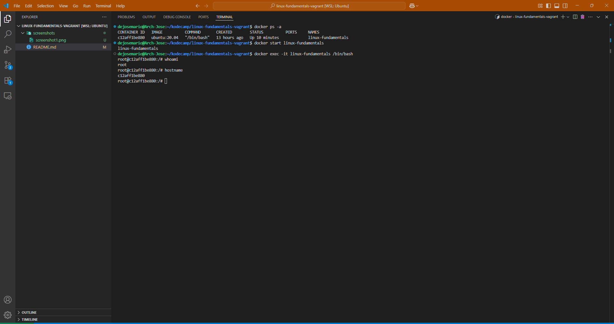
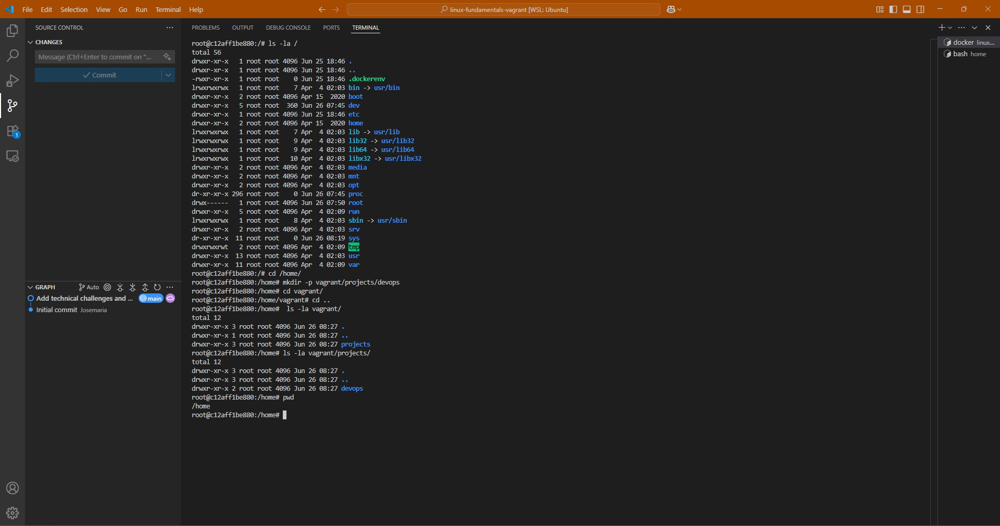
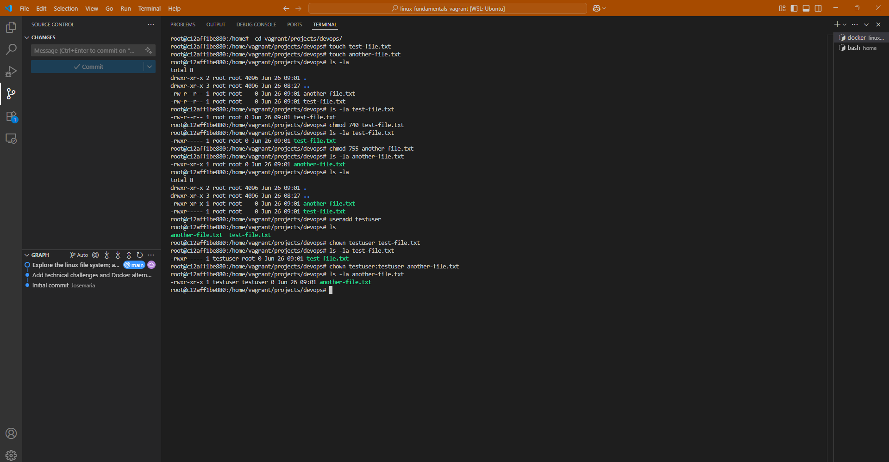
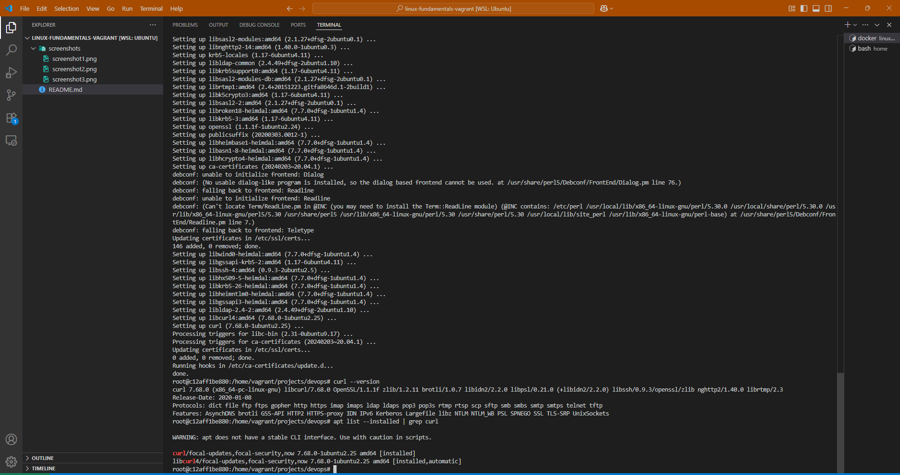

# linux-fundamentals-vagrant
This is a beginner-friendly project for learning Linux fundamentals using Vagrant. It includes tasks such as exploring the Linux file system, managing permissions, installing packages, and testing connectivity. 

## Technical Challenges Encountered

### Initial Setup Issue
I initially attempted to use Vagrant with VirtualBox as specified in the assignment. However, I encountered a compatibility conflict:

**Error encountered:**

**Root cause:**
- VirtualBox requires exclusive access to hardware virtualization
- Docker Desktop uses Hyper-V, which conflicts with VirtualBox
- WSL environment cannot access VirtualBox without special configuration

**Resolution:**
After researching the issue, I switched to using Docker as an alternative containerization solution. This provided the same learning environment (Ubuntu Linux) with identical system administration capabilities.

### Why Docker is a valid Alternative
- Provides isolated Ubuntu environment for learning
- Full root access for system administration tasks
- Same file system, permissions, and package management
- Industry-standard containerization technology
- No virtualization conflicts with existing Docker setup

## Assignment Completion

### 2. Set Up Ubuntu Server Environment

**Screenshot #1: Docker Container Initialization and Access**

**Description:**
This screenshot demonstrates setting up an Ubuntu Linux environment using Docker as an alternative to Vagrant. The process includes:

1. **Checking container status** with `docker ps -a` - showing the existing "linux-fundamentals" container
2. **Starting the container** with `docker start linux-fundamentals` 
3. **Accessing the environment** with `docker exec -it linux-fundamentals /bin/bash`
4. **Confirming access** as root user in the Ubuntu environment

**SSH Alternative:** Unlike Vagrant which requires SSH to access the virtual machine, Docker provides direct access to the container through the `docker exec` command. This eliminates the need for SSH configuration while providing the same isolated Linux environment for system administration practice.

### 3. Explore the Linux File System

**Screenshot #2: Custom Folder Structure Creation**

**Description:**
This screenshot shows exploring the Linux file system and creating a custom directory structure. The commands demonstrate:

1. **Navigation** to `/home` directory
2. **Creating nested directories** with `mkdir -p vagrant/projects/devops`
3. **Listing directory contents** with `ls -la` to verify the folder structure
4. **The created structure**: `/home/vagrant/projects/devops`

The `-p` flag in `mkdir` creates parent directories as needed, which is essential for creating nested directory structures in a single command.
### 4. Manage File Permissions and Ownership

**Screenshot #3: File Permissions and Ownership Management**

**Description:**
This screenshot demonstrates changing file permissions and ownership using `chmod` and `chown` commands:

1. **Created test files** with default permissions (`-rw-r--r--`)
2. **Changed permissions** using `chmod 740` and `chmod 755`
3. **Created new user** `testuser` 
4. **Changed ownership** using `chown testuser`

**Permission Values:**
- **740**: Owner can read/write/execute (7), group can read (4), others have no access (0)
- **755**: Owner can read/write/execute (7), group and others can read/execute (5)
- **Format**: `owner:group` shows file ownership

The numbers represent permission levels where read=4, write=2, execute=1, and they add up for combined permissions.

### 5. Install and Configure a Package

**Screenshot #4: Package Installation and Configuration**

**Description:**
This screenshot demonstrates installing a package using Ubuntu's package manager. The process shows:

1. **Package update** with `apt update` - refreshing the package repository lists
2. **Package installation** with `apt install curl -y` - installing the curl package
3. **Version verification** with `curl --version` - confirming successful installation
4. **Installation confirmation** with `apt list --installed | grep curl` - verifying the package is installed

**Package Management Explained:**
- `apt update` downloads the latest package information from repositories
- `apt install` downloads and installs the specified package with dependencies
- The `-y` flag automatically answers "yes" to installation prompts
- Version checking confirms the package is working correctly

This demonstrates basic Linux package management skills essential for system administration.

